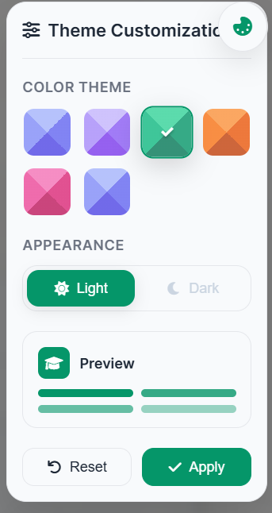

# EduRecommend — Coursera Course Recommender

Lightweight web app that recommends Coursera courses based on user-provided topic, skills, category and other preferences using TF-IDF and cosine similarity.

## 📑 Table of Contents
- About the Project
- Features
- System Architecture
- Tech Stack
- Installation
- Usage
- Screenshots
- Roadmap
- Contributing
- License
- Author / Contact

## 📌 About the Project
EduRecommend helps learners discover suitable Coursera courses by matching their interests and preferences (topic, skills, category, difficulty, estimated duration, language/subtitles) against a catalog of courses. It uses a simple, interpretable content-based recommendation approach (TF-IDF + cosine similarity) and presents results in a polished UI.

Who it's for:
- Students and lifelong learners looking for targeted course recommendations
- Educators and course curators testing lightweight recommender prototypes
- Portfolio/demo for software engineering / ML coursework

Why it matters:
- Reduces search friction for learners
- Demonstrates practical application of information retrieval techniques to recommender problems

## ✨ Features
- Content-based recommendations using TF-IDF and cosine similarity
- Filtering by category, difficulty, duration, language, and subtitles
- Polished responsive UI built with Jinja2 templates (templates/index.html, templates/recommendations.html)
- Sample course generation with realistic-looking ratings and metadata
- Rating breakdown and course detail modal per result card
- Theme & display mode support (persisted via form/session)
- No external DB required — data loaded/generated in-memory (easy to extend)

## 🏗 System Architecture
- Web frontend: HTML templates (Jinja2) rendered server-side
- Backend: Python Flask app (app.py) with routes:
  - `/` : Search form
  - `/recommend` : Recommendation endpoint (POST)
  - Theme API endpoints for theme updates
- Recommendation pipeline:
  1. User input assembled into a search query
  2. Courses filtered by preferences
  3. Course features text (title + category + skills) vectorized (TfidfVectorizer)
  4. Cosine similarity computed between user query and course vectors
  5. Top-N courses returned with enriched metadata (ratings distribution, similarity %)
- Data store: in-memory sample dataset generated in app.py; user ratings stored in a runtime dict (user_ratings)
- Templates and styles are contained in `templates/` (index.html & recommendations.html)

## 🛠 Tech Stack
- Python 3.8+ (recommended 3.10+)
- Flask (web framework) — app uses Flask routes and render_template
- pandas, numpy (data handling)
- scikit-learn (TfidfVectorizer, cosine_similarity)
- Jinja2 templates, HTML/CSS (templates/index.html, templates/recommendations.html)
- Optional: python-dotenv for environment variables

## ⚙ Installation

1. Clone the repository
   git clone https://github.com/kspeiris/Coursera-course-recommender.git
   cd Coursera-course-recommender

2. Create and activate a virtual environment
   python -m venv venv
   - On macOS/Linux: source venv/bin/activate
   - On Windows (PowerShell): venv\Scripts\Activate.ps1

3. Install dependencies
   - The repo includes a requirements.txt. Install with:
     pip install -r requirements.txt
   - Important: If Flask is not present after that (requirements.txt currently lists streamlit), also install Flask:
     pip install flask

4. (Optional) Create a .env file for environment variables if you plan to add config (e.g., FLASK_ENV)

5. Run the app
   - If app.py runs the Flask app directly:
     python app.py
   - Or use Flask CLI:
     export FLASK_APP=app.py
     export FLASK_ENV=development
     flask run
   The app should be available at http://127.0.0.1:5000/

Notes:
- The app currently constructs/generates sample course data in code (no external dataset required).
- If you add persistent storage (database), update config and installation steps accordingly.

## 🚀 Usage
1. Open the app in your browser (localhost:5000).
2. Fill in the Topic and any optional filters (skills, category, difficulty, duration, language, subtitles).
3. Submit the form to view ranked recommendations.
4. Each course card shows:
   - Match percentage
   - Title, category, key skills
   - Enrollment, duration, difficulty, number of ratings
   - “Explore This Course” link opens the provider page in a new tab
5. Click the details/rating breakdown to view more course metadata.

Implementation details:
- The recommendation function builds a `course_features` text field combining course name, category and skills and uses scikit-learn's TfidfVectorizer to compute similarity to the user query.
- Top N results are returned with enriched metadata (rating distribution, similarity score capped for display, generated sample stats when missing).

## 🖼 Screenshots / Demo
### Home Page

### Courses Page

### Themes

## 🛣 Roadmap / Future Enhancements
- Add persistence (database) for courses and user ratings
- Expand dataset by scraping/ingesting real Coursera metadata (respecting terms of service)
- Add collaborative-filtering hybrid model (user-item interactions)
- Improve NLP pipeline: better skill normalization, named-entity recognition, embeddings (SentenceTransformers)
- Add API endpoints for programmatic access (JSON REST)
- Dockerize for consistent deployment
- Add test suite (pytest) and CI (GitHub Actions)

## 🤝 Contributing
Contributions are welcome.
1. Fork the repo
2. Create a feature branch: git checkout -b feature/your-feature
3. Commit your changes and push: git push origin feature/your-feature
4. Open a Pull Request describing your change

## 👤 Author
**kspeiris**  
Software Engineering Undergraduate (University) — portfolio & coursework projects

GitHub: https://github.com/kspeiris

 tailored for recruiters (one-page resume-style)
- Add example screenshots or a Dockerfile for deployment
